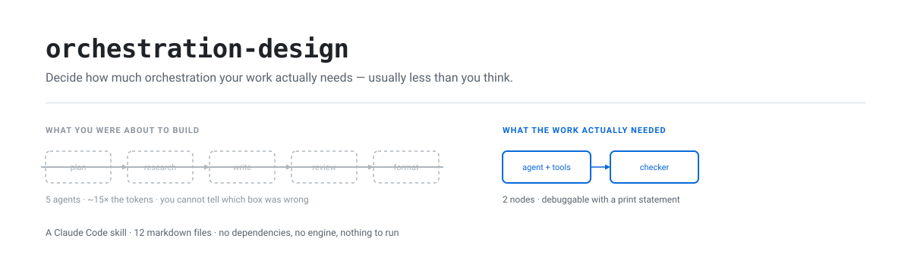

<picture>
  <source media="(prefers-color-scheme: dark)" srcset="docs/img/banner-dark.svg">
  
</picture>

# orchestration-design

> A Claude Code skill that decides **how much orchestration your work actually needs** — and usually concludes it's less than you think. 12 markdown files. No dependencies, no engine, nothing to run.

Built by **[Sachin Sharma](https://www.linkedin.com/in/sachinsharma8080/)** — Bug Hunting & GenAI Security Research.

---

## Does any of this sound familiar?

| What you'd say out loud | What's actually wrong |
|---|---|
| *"My pipeline is a mess and I'm scared to touch it."* | Node count. Past ~7 nodes most designs contain steps masquerading as nodes. |
| *"One bad item kills the whole batch."* | An exception escaping a branch instead of being caught inside it. |
| *"It re-runs everything from scratch after one failure."* | No checkpointer. A persistence problem wearing an orchestration costume. |
| *"It loops forever."* / *"Costs exploded overnight."* | A missing attempt cap, step limit, or spend field a router actually reads. |
| *"Outputs change between identical runs."* | Two nodes writing one state field. The highest-yield bug in this whole class. |
| *"The reviewer approves everything."* | Same model, same context, grading its own homework. |
| *"Everyone's using multi-agent — should we?"* | Probably not. Keep reading. |

You don't need the vocabulary to use this. Describe the symptom in plain English and the skill loads itself.

---

## The 60-second check — no install required

Before anything else, run the single highest-yield check by hand. **List every field in your shared state. For each one, count the nodes that write it.**

```
state field        written by                     verdict
─────────────────────────────────────────────────────────────────────
results            worker, summarizer             ← TWO WRITERS. This is your bug.
attempts           writer                         ok
errors             every node (append reducer)    ok — declared append
```

Any field with more than one writer and no declared reducer is **state drift**: your run is non-deterministic and nobody knows which node won. Fix that one thing and a surprising number of "flaky agent" problems evaporate.

If that found something, the rest of this is worth your time.

---

## What it actually does

It's an opinionated advisor that interrupts you *before* you write the wrong thing.

**You ask:** *"Build me a multi-agent system that fetches an article, chunks it, summarizes each chunk, reviews the summary, and formats it as markdown."*

**It answers:**

> Fetching is a tool call. Chunking is a `for` loop. Formatting is a template. That's three functions, not three agents. And your "reviewer" is the same model grading its own homework, so it will approve almost anything.
>
> What you want is one agent with a fetch tool and one *independent* checker. That's level 3 of 6. Here's the design — change anything before I build it?

You ship in an afternoon instead of a week, and you can debug it with a print statement.

When the work **genuinely** needs structure, the same ladder says so — and names the specific trigger (*"the work exceeds one context window"*, not *"this feels complicated"*). Then it designs on paper first, shows you the diagram so you can delete what you don't want, builds on whatever stack you actually use, and **asserts** that the code matches the diagram you approved.

---

## Why "usually less than you think" is a claim, not an opinion

Every framework's docs show the same picture: five boxes with arrows. It looks like engineering. So you build it, it costs ~15× what you expected, runs slower than one agent would have, and when it's wrong you can't tell which box did it.

From the 2026 literature:

- Anthropic's widely-quoted result — multi-agent beating single-agent by **90.2%** — came with a footnote almost nobody repeats: it used **~15× the tokens**, and **token spend alone explained 80% of the performance variance**.
- Two follow-up papers held compute constant. Most of the advantage disappeared. Under matched thinking-token budgets a single agent was **best or statistically indistinguishable from best at every budget except the lowest**.
- Across seven multi-agent frameworks, measured correctness was poor — ChatDev at **33.3%** on ProgramDev, AppWorld at **86.7% failure** on cross-app tests.

**Most people building agent systems right now are paying multi-agent prices for single-agent quality.** Full citations in [Sources](#sources); the reasoning is in `references/evidence.md`, which separates controlled experiments from single-company production reports.

---

## Two ways in

### A. You already built it, and it's bad → **start here**

This is the common case and the honest front door. The skill reconstructs the design your code *actually* implements — nodes, edges, state ownership, bounds — then diffs it against what a good design would be.

> "This has grown too complex." · "It works but I'm scared of it." · "I inherited this."

It does **not** open with a rewrite proposal. It makes the existing design visible first, because half the findings become obvious the moment someone sees it written down. Then it ranks fixes by what they cost *you* — correctness first, runaway risk second, structure third — and proposes the smallest sequence of changes that each ship independently.

→ `references/auditing-an-existing-graph.md`

### B. You're about to build something new

Phases 0 → 4: scope the work, pick the level, design on paper, **show a human and stop**, implement on your runtime, verify by assertion.

The hard stop at Phase 2.5 is the part that earns its keep. You get an ASCII sketch, a Mermaid block, a pre-filled [mermaid.live](https://mermaid.live) edit link, and one **specific** question — *"which node would you delete?"* — because open approval questions get "looks fine" and specific ones get real answers. People cut more than they add once they can see the shape.

---

## The ladder

Six levels, simplest first. Start at 1. **Stop at the first level that holds.** Climb only when that level's named trigger is *literally true*.

| Level | Shape | Climb past it only when |
|---|---|---|
| **1 · Plain script** | Deterministic code, no model | The work needs judgement a rule cannot encode |
| **2 · Loop** | One agent with tools, self-terminating | Correctness can't be asserted mechanically |
| **3 · Loop + reviewer** ← default | One writer, one read-only checker, clean context | — |
| **4 · Reviewer panel** | Several lenses, one synthesis | One reviewer provably misses a whole defect class |
| **5 · Fan-out** | One branch per item, isolated failures | **The work exceeds one context window** |
| **6 · Durable workflow** | Persistent, resumable, scheduled | The run outlives a process, or needs replay |

**Levels are picked per stage, not per system.** Most real designs are mixed.

**What does *not* justify climbing:** task difficulty, step count, "feels complex", "could run in parallel", or wanting the design to look sophisticated. Independence is a *precondition* for fan-out, not a trigger — nearly every batch has independent items, so treating that as sufficient sends everything to level 5.

**Landing on level 1 or 2 is a successful use of this skill**, and the most common correct outcome.

---

## System or process? Both are orchestration

Most orchestration writing assumes your output is software. A great deal of multi-step work with a model isn't.

|  | **System** | **Process** |
|---|---|---|
| Output | code that runs without you | work that runs *with* you |
| Examples | pipeline, batch job, service | research project, audit, migration, manuscript, hiring round |
| Nodes are | functions, model calls, agents | prompts, subagents, **human decisions** |
| State is | a dataclass, a checkpointer | a **ledger file** |
| Bounds are | attempt counters, token budgets | rounds, budget, wall clock |

The method is identical; only the substrate changes. → `references/targets/procedural.md`

That file carries the pattern that generalises furthest: **generate the "not covered" section from your ledger rather than from memory — every time, including when it's empty.** A deliverable that lists what was found and stays silent on what was never examined implies coverage it didn't achieve. That's the default failure of every report, review and summary written from recall.

---

## See it run

A support-ticket triage built with the skill — level 3, one writer, one independent reviewer, bounded.


The reviewer caught a cross-account data leak filed as P2 and raised it to P0. That's the whole argument for level 3 in one line.

Then the verification phase proves the design holds — the reviewer never edits, the bound is live, exhaustion is marked, a malformed item is isolated:


---

## What it catches, with numbers

Findings from real runs. The ones worth publishing are the ones where the skill said **no**.

**A loop-back edge that could never do anything.** A design added a cycle so findings could feed new work back into the pipeline. Sound premise — except no node *inside* the cycle wrote the state the re-entry point read. One grep proved it:

```
who writes `surface` inside the loop?   grep -n 'add_surface' engine/*.py
  -> only recon(), which is OUTSIDE the loop   ==> DECORATIVE
```

Rounds 2 and 3 did no work and the run declared victory. **~120 lines of loop, bounds and dryness machinery deleted**; the implementation went from ~230 lines to ~110 and did strictly more.

**A bound that was decorative.** A spend budget incremented at the live API call — so in the project's own mock mode it never incremented, the cap never fired, and the bound was **untested in every test that existed**. Caught by Phase 4's *"force the condition each bound guards."* Moving the counter to the dispatch point made it real.

**A reviewer that wasn't independent.** Producer and reviewer sharing a model and a context. Same fix everywhere: separate step, clean context, verdict only, never edits the artifact.

The pattern across all three: **none would have surfaced from re-reading the design.** They surfaced from assertions and one grep.

---

## What's in the skill

```
SKILL.md                          the method — phases 0 through 4
references/
  evidence.md                     the research behind the two rules, dated
  graph-design.md                 the runtime-free design method (Phase 2)
  design-checklist.md             annotated 8-point review checklist
  anti-patterns.md                symptom -> diagnosis -> fix
  auditing-an-existing-graph.md   Track B — for what already exists
  targets/
    procedural.md                 output is a process, not software
    plain-code.md                 try this first, for systems
    langgraph-python.md
    langgraph-js.md
    claude-code-subagents.md
    durable-workflow.md
```

Two rules hold at every level, and both come from the evidence:

1. **One writer. Always.** Extra nodes contribute judgement, never edits.
2. **Structure does not buy intelligence.** At matched token budgets a single agent matches or beats multi-agent designs. Climbing costs money and reliability.

---

## Install

```bash
git clone https://github.com/elementalsouls/orchestration-design.git
cd orchestration-design
./build.sh
```

Packages the skill and copies it to `~/.claude/skills/orchestration-design/`. Re-run after any edit under `skill/`. To uninstall: `rm -rf ~/.claude/skills/orchestration-design`.

It fires on its own from topic — you don't invoke it by name. Say *"my pipeline is a mess"* or *"should this be multi-agent?"* and it loads.

---

## Why this might help you

**Someone finally wrote down the "no."** There's an enormous amount of material on how to build multi-agent systems and almost none on when not to. Nobody gets engagement from a post saying "you probably need one agent." This treats the refusal as its primary output and cites its reasons.

**Your design outlives your framework.** Nodes, state ownership and bounds are identical whether you use LangGraph, TypeScript, or eighty lines of `asyncio`. The runtime is picked **last**, and `plain-code.md` is the honest answer more often than framework marketing suggests.

**It gives junior developers an argument.** When a lead says "let's make it multi-agent," you can point at controlled experiments and say: *let's match the token budget first, then compare.*

---

## Honest limits

**It is a prompt, not a program.** There's no engine. Nothing scans your codebase or generates architecture. Its entire power is that Claude reads good instructions and follows them. The `.py` files here are examples for humans and are deliberately **not** shipped in the skill bundle.

**It will argue with you.** If you want a graph and the work doesn't justify one, it says so. That's the design, and some people will find it annoying.

**It does not prevent every wrong call.** In one run it produced a decorative loop, then over-corrected into a straight line for work that genuinely iterated. Evidence caught both; the ladder caught neither. What the skill reliably gives you is the *method and vocabulary to catch it* — a premise check, an assertion, a grep — which is worth more than a promise it can't keep.

**The research will age.** Core papers are 2025–2026. If models get dramatically better at coordinating, the loop-first default weakens. `evidence.md` is dated so you can see the shelf life.

**Tested end to end six times — twice by agents that had never seen it.** Four runs by the author, then two *cold-context* runs: a fresh agent given only the user's request and the installed skill file, with no knowledge of the project. Those two are the useful evidence, because the author cannot evaluate a document he wrote from memory.

The four authored runs, where the ladder discriminated rather than giving one answer every time:

| Task | Level | Outcome |
|---|---|---|
| Validate 77 installed Claude skills | 1 · plain script | Gate refused a graph. Verification then caught two false-positive bugs in the tool it had just written |
| Generate release notes from git history | 3 · loop + reviewer | Reviewer caught a hallucinated "CI pipeline" claim that no commit supported |
| Replace six manual test commands | 1 · plain script | Gate refused again. Found 4 of the 6 documented commands were silently unrunnable |
| Triage support tickets | 3 · loop + reviewer | Reviewer caught a cross-account data leak filed P2 instead of P0 |

Six trials is not a track record. But it was enough to find **thirteen defects in the skill itself**, every one from *using* it rather than reading it. The cold runs alone caught six: file references to things the bundle doesn't ship, a design smell that fired on correct designs, a verification phase that assumed a reviewer which levels 1–2 don't have, a spend budget that assumed tokens where nothing costs tokens, an ambiguity about whether Phase 0 asks or assumes, and no prompt anywhere about legal or ethical bounds for a tool that touches third-party data.

None of those would have surfaced from re-reading the file. That is the method worth stealing more than anything else here: **have something with no memory of writing it try to follow it.**

---

## Sources

- [Anthropic — How we built our multi-agent research system](https://www.anthropic.com/engineering/multi-agent-research-system) — the 90.2% claim, 15× token cost, 80%-of-variance finding
- [Tran & Kiela — Single-Agent LLMs Outperform Multi-Agent Systems Under Equal Thinking Token Budgets](https://arxiv.org/abs/2604.02460) — the controlled comparison
- [The Illusion of Multi-Agent Advantage](https://arxiv.org/abs/2606.13003) — replication across GPQA, SWE-bench, BrowseCompPlus
- [Cemri et al. — Why Do Multi-Agent LLM Systems Fail?](https://arxiv.org/abs/2503.13657) (NeurIPS 2025) — the MAST taxonomy and failure rates
- [Cognition — Don't Build Multi-Agents](https://cognition.com/blog/dont-build-multi-agents) (2025)
- [Cognition — Multi-Agents: What's Actually Working](https://cognition.com/blog/multi-agents-working) (2026) — the single-writer rule
- Original checklist: [aibuilderclub — Graph Engineering Guide 2026](https://www.aibuilderclub.com/blog/graph-engineering-guide-2026)

---

## Repo layout

```
skill/orchestration-design/    skill source — edit here, then ./build.sh
reference-implementation/      five runnable examples + verify_topology.py
examples/ticket-triage/        full worked walkthrough, start to finish
tools/gen_banner.py            README banner (regenerate, never hand-edit)
tools/mermaid_link.py          diagram -> pre-filled mermaid.live edit URL
tools/term_svg.py              captured terminal output -> SVG for this README
docs/img/                      generated images (regenerate, never hand-edit)
run_checks.py                  run every check; one command, one exit code
orchestration-design.skill     packaged bundle (zip)
build.sh                       package + install to ~/.claude/skills/
CLAUDE.md                      conventions for working on this repo
```

> **Why not "graph engineering"?** That was the original name, and it set the wrong expectation — you'd install it looking for a graph builder and get a gatekeeper. "Loop vs. graph" is a false choice anyway: **a loop is a graph with one node and one edge back to itself.** The real questions are how many writers, and who decides the routing. Ask it that way and the answer is usually *one writer, plus a reviewer*.
