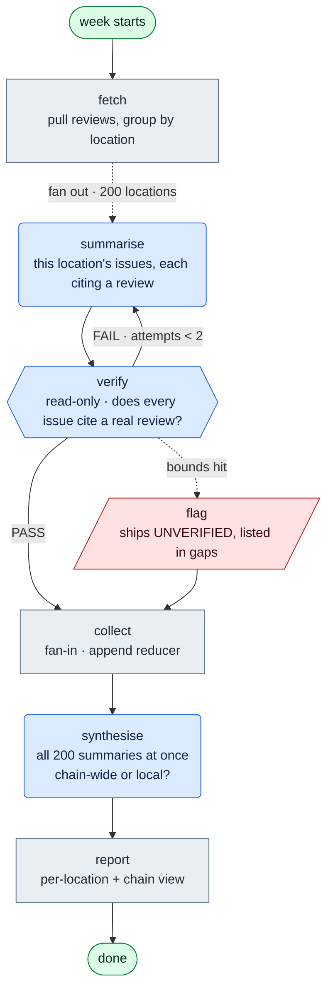

![orchestration-design, a skill for Claude Code and Hermes. Stop paying multi-agent prices for single-agent quality. The gatekeeper decides exactly how much orchestration your pipeline actually needs; the emergency brake is tactical micro-skills that snap agents out of endless execution loops; runtime free means designs built for plain code, LangGraph, or any framework you choose. Backed by 2026 AI research — a quoted 90.2% multi-agent win cost 15x the tokens, and 80% of the variance was spend rather than architecture.](docs/img/banner.svg)

# orchestration-design

[](https://github.com/elementalsouls/orchestration-design/actions/workflows/checks.yml)
[](LICENSE)
[](skill/orchestration-design/SKILL.md)
[](#install)
[](skill/orchestration-design/references/evidence.md)

> ## Stop paying multi-agent prices for single-agent quality.
>
> It tells you **exactly how much orchestration your work needs**, designs it before a line is written, and ships **tactical micro-skills that break an agent out of an execution loop** when you're already stuck.
>
> 12 markdown files. No runtime, no dependencies, nothing to import.

```bash
git clone https://github.com/elementalsouls/orchestration-design.git
cd orchestration-design && ./build.sh
```

Then say *"my pipeline is a mess"* or *"I'm stuck in a loop"*. The skill loads itself — you never invoke it by name.

Runs on **Claude Code** and **Hermes**. `./build.sh` installs for Claude Code; on Hermes, point it at the `skill/orchestration-design/` directory — the package is portable because it is markdown with no runtime, no imports and no build step.

Built by **[Sachin Sharma](https://www.linkedin.com/in/sachinsharma8080/)** — Bug Hunting & GenAI Security Research.

---

## Does any of this sound familiar?

| What you'd say out loud | What's actually wrong |
|---|---|
| *"My pipeline is a mess and I'm scared to touch it."* | Node count. Past ~7 nodes most designs contain steps masquerading as nodes. |
| *"One bad item kills the whole batch."* | An exception escaping a branch instead of being caught inside it. |
| *"It re-runs everything from scratch after one failure."* | No checkpointer. A persistence problem wearing an orchestration costume. |
| *"It loops forever."* / *"Costs exploded overnight."* | A missing attempt cap, step limit, or spend field a router actually reads. |
| *"Outputs change between identical runs."* | Two nodes writing one state field. The highest-yield bug in this whole class. |
| *"The reviewer approves everything."* | Same model, same context, grading its own homework. |
| *"Everyone's using multi-agent — should we?"* | Usually not — but sometimes yes, and the skill names the trigger either way. |
| *"We're fanning out over 10,000 items and it's fragile."* | That trigger is real. Level 5 is the right answer; it just needs bounds and one writer. |

You don't need the vocabulary to use this. Describe the symptom in plain English and the skill loads itself.

---

## The 60-second check — no install required

Before anything else, run the single highest-yield check by hand. **List every field in your shared state. For each one, count the nodes that write it.**

```
state field        written by                     verdict
─────────────────────────────────────────────────────────────────────
results            worker, summarizer             ← TWO WRITERS. This is your bug.
attempts           writer                         ok
errors             every node (append reducer)    ok — declared append
```

Any field with more than one writer and no declared reducer is **state drift**: your run is non-deterministic and nobody knows which node won. Fix that one thing and a surprising number of "flaky agent" problems evaporate.

If that found something, the rest of this is worth your time.

---

## What it actually does

It's an opinionated advisor that interrupts you *before* you write the wrong thing.

**You ask:** *"Build me a multi-agent system that fetches an article, chunks it, summarizes each chunk, reviews the summary, and formats it as markdown."*

**It answers:**

> Fetching is a tool call. Chunking is a `for` loop. Formatting is a template. That's three functions, not three agents. And your "reviewer" is the same model grading its own homework, so it will approve almost anything.
>
> What you want is one agent with a fetch tool and one *independent* checker. That's level 3 of 6. Here's the design — change anything before I build it?

You ship in an afternoon instead of a week, and you can debug it with a print statement.

When the work **genuinely** needs structure, the same ladder says so — and names the specific trigger (*"the work exceeds one context window"*, not *"this feels complicated"*). Then it designs on paper first, shows you the diagram so you can delete what you don't want, builds on whatever stack you actually use, and **asserts** that the code matches the diagram you approved.

---

## What it hands you

Not advice — a design you can argue with. This is the real output for *"3,000 customer reviews a week across 200 restaurant locations, find out what's going wrong at each one"*:



**The colours carry information, not decoration.** Grey is deterministic code — free. Blue is exactly one model call — one bill. Red is the exhaustion terminal: bounds hit, work ships *marked* rather than silently. There is a fifth, amber, for an agent node that loops with tools until it decides it's done — **unbounded by default**, and its absence here tells you nothing in this design can run away.

**Node ids are the function names.** `fetch` in the diagram is `def fetch(...)` in the code. That correspondence is what makes the picture checkable instead of decorative — and at levels 1–3, where no framework emits a topology, it's the only correspondence there is.

Two numbers decided the whole shape. A week of raw reviews is **240,000 tokens** — exceeds one context window, so the work must split. All 200 summaries together are **30,000** — so they don't. Fan out where it's forced, rejoin where it isn't, because *"is this chain-wide or just this branch?"* is a question no single branch can answer.

A second worked example, end to end with its assertions, lives in [`examples/ticket-triage/`](examples/ticket-triage/).

---

## Two ways in

### A. You already built it, and it's bad → **start here**

This is the common case and the honest front door. The skill reconstructs the design your code *actually* implements — nodes, edges, state ownership, bounds — then diffs it against what a good design would be.

> "This has grown too complex." · "It works but I'm scared of it." · "I inherited this."

It does **not** open with a rewrite proposal. It makes the existing design visible first, because half the findings become obvious the moment someone sees it written down. Then it ranks fixes by what they cost *you* — correctness first, runaway risk second, structure third — and proposes the smallest sequence of changes that each ship independently.

→ `references/auditing-an-existing-graph.md`

### B. You're about to build something new

Phases 0 → 4: scope the work, pick the level, design on paper, **show a human and stop**, implement on your runtime, verify by assertion.

The hard stop at Phase 2.5 is the part that earns its keep. You get an ASCII sketch, a Mermaid block, an *offer* of a pre-filled [mermaid.live](https://mermaid.live) edit link — offered rather than pasted, because an unrequested opaque URL to a third-party site is the wrong default for a proprietary architecture — and one **specific** question: *"which node would you delete?"* Open approval questions get "looks fine"; specific ones get real answers. People cut more than they add once they can see the shape.

---

## The ladder

Six levels, simplest first. Start at 1. **Stop at the first level that holds.** Climb only when that level's named trigger is *literally true*.

| Level | Shape | Climb past it only when |
|---|---|---|
| **1 · Plain script** | Deterministic code, no model | The work needs judgement a rule cannot encode |
| **2 · Loop** | One agent with tools, self-terminating | Correctness can't be asserted mechanically |
| **3 · Loop + reviewer** ← default | One writer, one read-only checker, clean context | — |
| **4 · Reviewer panel** | Several lenses, one synthesis | One reviewer provably misses a whole defect class |
| **5 · Fan-out** | One branch per item, isolated failures | **The work exceeds one context window** |
| **6 · Durable workflow** | Persistent, resumable, scheduled | The run outlives a process, or needs replay |

**Levels are picked per stage, not per system.** Most real designs are mixed.

**What does *not* justify climbing:** task difficulty, step count, "feels complex", "could run in parallel", or wanting the design to look sophisticated. Independence is a *precondition* for fan-out, not a trigger — nearly every batch has independent items, so treating that as sufficient sends everything to level 5.

**Landing on level 1 or 2 is a successful use of this skill**, and the most common correct outcome.

**Landing on level 5 or 6 is equally successful** — it is just rarer. When the trigger is literally true, the skill does not talk you out of it: it designs the fan-out, puts an append reducer on every field the branches write, asserts `len(results) == len(items) - len(errors)` so silent loss can't hide, and hands you a runnable implementation on your framework. The gate exists to make the climb *earned*, not to cap you at level 3.

---

## When you're already building, and stuck

The ladder decides *what to build*. It does nothing for the other failure: the design is right, the level is right, and execution is going in circles anyway. Re-architecting does not fix that — **a new topology cannot repair a wrong premise**, and climbing a level to escape a loop just spreads the same guessing across more nodes and more spend.

So there is a second layer. `modules/` holds self-contained protocols you invoke *instead of* designing, and a user who arrives already stuck skips phases 0–2 entirely.

| Module | Fires | What it forces |
|---|---|---|
| **`context-auditor`** | **Before** a loop | Every count, path, version and name in an always-loaded file is a claim the world can invalidate — and from the inside, a stale fact and a true fact look identical. Verifies them, and scopes or cuts rules whose reason nobody can state. |
| **`rubber-duck-verifier`** | **During** one | Stop writing code. Text-only tear-down — goal, the failure quoted exactly, what each attempt *disproved*, and what you still don't know — before any further edit. |
| **`adversarial-reviewer`** | **After** work exists | Reviews from a separate clean context, given the artifact and the requirement but never the reasoning that produced it. Its job is to break the code, and a verdict of "looks good" without saying what was tried is not a review. |

**The order is the point.** `context-auditor` prevents loops by removing the wrong premises that cause them; `rubber-duck-verifier` breaks one already running; `adversarial-reviewer` catches what survives. Reaching for the third when the first was skipped is the common expensive mistake — **a reviewer cannot see a premise that is wrong in both the code and the review.**

Entry conditions are observations, not feelings: the same file edited three times with the error unchanged, a test failing the same way twice, or choosing the next fix because the last one failed. One is enough. Routing lives in [`references/tactical-interventions.md`](skill/orchestration-design/references/tactical-interventions.md).

---

## The research this is built on

This skill is not a set of opinions about architecture. It is a reading of the 2025–2026 literature, turned into a decision procedure. Every default in it traces to one of these.

| Source | What it establishes | Weight |
|---|---|---|
| [Anthropic — *How we built our multi-agent research system*](https://www.anthropic.com/engineering/multi-agent-research-system) | The **90.2%** multi-agent win everyone quotes — and the footnote almost nobody repeats: it used **~15× the tokens**, **token spend alone explained 80% of the performance variance**, and three factors together explained **95%**. | Production report |
| [Tran & Kiela — *Single-Agent LLMs Outperform Multi-Agent Systems Under Equal Thinking Token Budgets*](https://arxiv.org/abs/2604.02460) | Holds compute constant. A single agent was **best or statistically indistinguishable from best at every budget except the lowest (100 tokens)**. Grounded in the **Data Processing Inequality**: a handoff can lose information, never create it. Also finds the **crossover** — under heavy context degradation (α = 0.7) multi-agent does overtake. | **Controlled experiment** |
| [Jwalapuram et al. — *The Illusion of Multi-Agent Advantage*](https://arxiv.org/abs/2606.13003) | Auto-generated multi-agent architectures **"consistently underperform CoT-SC despite being up to 10x more expensive."** A cost-effectiveness result, not a second replication — same direction, different route. | **Controlled experiment** |
| [Cemri et al. — *Why Do Multi-Agent LLM Systems Fail?*](https://arxiv.org/abs/2503.13657) · NeurIPS 2025 | The MAST taxonomy — **1600+ traces, 7 frameworks, κ = 0.88, 14 failure modes in 3 categories.** Targeted fixes gave *"+14% improvement for ChatDev, [but] the improved performance remains insufficiently low for real-world deployment."* | Peer-reviewed |
| [Cognition — *Don't Build Multi-Agents*](https://cognition.com/blog/dont-build-multi-agents) (2025) | Why parallel writers making conflicting implicit decisions is the failure mode that killed agent-swarm designs industry-wide. | Practitioner |
| [Cognition — *Multi-Agents: What's Actually Working*](https://cognition.com/blog/multi-agents-working) (2026) | The **single-writer rule** — the one structural constraint that survives contact with production. | Practitioner |
| [LangChain — *3 Years of Graph Engineering with LangGraph*](https://www.langchain.com/blog/3-years-of-graph-engineering-with-langgraph) (2026) | The graph vendor's own **"loops are simple graphs"**, and two teams — LangChain's deep research and GPT Researcher — migrating graph → loop. An admission against interest. Also the seventh trigger: **is the route knowable at all?** | Practitioner (weigh as vendor) |
| [aibuilderclub — *Graph Engineering Guide 2026*](https://www.aibuilderclub.com/blog/graph-engineering-guide-2026) | The five-layer model and the 8-point checklist this skill grew out of, plus *"state drift is the #1 way graphs rot."* | Practitioner |

**The conclusion the papers converge on:** most people building agent systems right now are paying multi-agent prices for single-agent quality.

Two rules fall out of that, and they hold at every level of the ladder:

1. **One writer. Always.** Extra nodes contribute judgement, never edits.
2. **Structure does not buy intelligence.** Climbing costs money and reliability. Most reported multi-agent wins track token spend, not architecture.

`references/evidence.md` carries the full reading, **dated**, and separates controlled experiments from single-company production reports — so you can see the shelf life and weigh each claim yourself. If the models get dramatically better at coordinating, the loop-first default weakens, and the file says so.

---

## System or process? Both are orchestration

Most orchestration writing assumes your output is software. A great deal of multi-step work with a model isn't.

|  | **System** | **Process** |
|---|---|---|
| Output | code that runs without you | work that runs *with* you |
| Examples | pipeline, batch job, service | research project, audit, migration, manuscript, hiring round |
| Nodes are | functions, model calls, agents | prompts, subagents, **human decisions** |
| State is | a dataclass, a checkpointer | a **ledger file** |
| Bounds are | attempt counters, token budgets | rounds, budget, wall clock |

The method is identical; only the substrate changes. → `references/targets/procedural.md`

**And when the substrate *is* a framework, LangGraph is a first-class target, not an afterthought.** Loop-first is a claim about *defaults*, not a rejection: four of the five reference implementations are built on LangGraph v1.0 (`StateGraph`, `START`/`END`, `Send`, `Command`), and `verify_topology.py` asserts LangGraph's own `draw_mermaid()` output against the diagram a human approved — the deepest integration in the repo. Where fan-out with managed concurrency, durable state or complex routing genuinely earns a framework, Phase 3a routes you straight to it with working examples. What the skill refuses is adopting one for three sequential steps.

That file carries the pattern that generalises furthest: **generate the "not covered" section from your ledger rather than from memory — every time, including when it's empty.** A deliverable that lists what was found and stays silent on what was never examined implies coverage it didn't achieve. That's the default failure of every report, review and summary written from recall.

---

## See it run

A support-ticket triage built with the skill — level 3, one writer, one independent reviewer, bounded.


The reviewer caught a cross-account data leak filed as P2 and raised it to P0. That's the whole argument for level 3 in one line.

Then the verification phase proves the design holds — the reviewer never edits, the bound is live, exhaustion is marked, a malformed item is isolated:


---

## What it catches, with numbers

Findings from real runs. The ones worth publishing are the ones where the skill said **no**.

**A loop-back edge that could never do anything.** A design added a cycle so findings could feed new work back into the pipeline. Sound premise — except no node *inside* the cycle wrote the state the re-entry point read. One grep proved it:

```
who writes `surface` inside the loop?   grep -n 'add_surface' engine/*.py
  -> only recon(), which is OUTSIDE the loop   ==> DECORATIVE
```

Rounds 2 and 3 did no work and the run declared victory. **~120 lines of loop, bounds and dryness machinery deleted**; the implementation went from ~230 lines to ~110 and did strictly more.

**A bound that was decorative.** A spend budget incremented at the live API call — so in the project's own mock mode it never incremented, the cap never fired, and the bound was **untested in every test that existed**. Caught by Phase 4's *"force the condition each bound guards."* Moving the counter to the dispatch point made it real.

**A reviewer that wasn't independent.** Producer and reviewer sharing a model and a context. Same fix everywhere: separate step, clean context, verdict only, never edits the artifact.

The pattern across all three: **none would have surfaced from re-reading the design.** They surfaced from assertions and one grep.

---

## How it was tested — by agents that had never seen it

The author cannot evaluate a document he wrote from memory. So half the runs were **cold-context**: a fresh agent given only the user's request and the installed skill file, with no knowledge of this project, no access to the repo, and no idea what answer was wanted.

**Eight end-to-end runs on the skill — four by the author, four cold** — plus a ninth cold run against the [skill-design standard](docs/skill-design-standard.md) itself, which had a fresh agent author a new skill from that document alone.

The cold runs are the useful evidence. The author's four matter for a different reason — the ladder *discriminated* rather than giving one answer every time:

| Task | Level | Outcome |
|---|---|---|
| Validate 77 installed Claude skills | 1 · plain script | Gate refused a graph. Verification then caught two false-positive bugs in the tool it had just written |
| Generate release notes from git history | 3 · loop + reviewer | Reviewer caught a hallucinated "CI pipeline" claim that no commit supported |
| Replace six manual test commands | 1 · plain script | Gate refused again. Found 4 of the 6 documented commands were silently unrunnable |
| Triage support tickets | 3 · loop + reviewer | Reviewer caught a cross-account data leak filed P2 instead of P0 |

Every defect below came from *using* the skill, not reading it. Traceable to a commit each:

| Found by | Defects | Examples |
|---|---|---|
| Cold runs 1–2 | **7** | File references to things the bundle doesn't ship · a design smell that fired on correct designs · a verification phase assuming a reviewer levels 1–2 don't have · a spend budget assuming tokens where nothing costs tokens · whether Phase 0 asks or assumes |
| Cold runs 3–4 | **1**, the worst | Given a *process* request — a compliance audit, no code — the skill **did not fire at all**. Zero invocations, because every trigger was a software noun. The fix was to the description, not the method; the identical request afterwards fired on the first turn |
| Auditing against those runs | **9** | Self-inconsistencies — the repo breaking its own stated conventions |
| Cold run 5, against the standard | **8** | A fresh agent authored a skill from `skill-design-standard.md` alone. It passed — and returned eight defects in the standard |

**Twenty-five defects, of which twenty-four came from a cold run or an audit against one.** The number keeps climbing because the method keeps working, not because the document keeps rotting.

None of those would have surfaced from re-reading the file. **That is the method worth stealing more than anything else here: have something with no memory of writing it try to follow it.**

---

## What's in the skill

```
SKILL.md                          the method — phases 0 through 4
references/
  evidence.md                     the research behind the two rules, dated
  graph-design.md                 the runtime-free design method (Phase 2)
  design-checklist.md             annotated design-review checklist
  anti-patterns.md                symptom -> diagnosis -> fix
  auditing-an-existing-graph.md   Track B — for what already exists
  targets/
    procedural.md                 output is a process, not software
    plain-code.md                 try this first, for systems
    langgraph-python.md           LangGraph v1.0 — 4 of 5 reference impls
    langgraph-js.md               LangGraph, TypeScript
    claude-code-subagents.md      orchestrating Claude Code subagents
    durable-workflow.md           needs replay, schedules, human pauses
```

---

## Install

```bash
git clone https://github.com/elementalsouls/orchestration-design.git
cd orchestration-design
./build.sh
```

Packages the skill and copies it to `~/.claude/skills/orchestration-design/`. Re-run after any edit under `skill/`. To uninstall: `rm -rf ~/.claude/skills/orchestration-design`.

It fires on its own from topic — you don't invoke it by name. Say *"my pipeline is a mess"* or *"should this be multi-agent?"* and it loads.

**To run the repo itself** — the five reference implementations and the checks that prove them:

```bash
python3 run_checks.py            # all ten checks, one exit code
python3 run_checks.py --setup    # create .venv and install langgraph first
```

Four of the five implementations need `langgraph`; `--setup` installs it into a local `.venv`. Without it those checks report `NO-DEP` and fail loudly rather than skipping green — use `--allow-skip` if you want them tolerated. Nothing here is needed to *use* the skill; it's how you check the examples still work after an edit.

---

## Why this might help you

**Someone finally wrote down the "no."** There's an enormous amount of material on how to build multi-agent systems and almost none on when not to. Nobody gets engagement from a post saying "you probably need one agent." This treats the refusal as its primary output and cites its reasons.

**Your design outlives your framework.** Nodes, state ownership and bounds are identical whether you use LangGraph, TypeScript, or eighty lines of `asyncio`. The runtime is picked **last**, and `plain-code.md` is the honest answer more often than framework marketing suggests.

**It gives junior developers an argument.** When a lead says "let's make it multi-agent," you can point at controlled experiments and say: *let's match the token budget first, then compare.*

---

## Honest limits

**The skill is a prompt, not a program.** Nothing scans your codebase or generates architecture. Its entire power is that Claude reads good instructions and follows them — which is why the installed bundle is markdown only, with no runtime and nothing to import. The Python in this repo is deliberately *not* in that bundle, and it is not decoration either: it's the five reference implementations plus the harness that checks them, including `verify_topology.py`, which asserts LangGraph's emitted diagram against the approved one. You run that here; you don't install it.

**It will argue with you.** If you want a graph and the work doesn't justify one, it says so, and some people will find that annoying. It argues from a *named trigger*, though — so the argument ends the moment the trigger is true. Bring real fan-out and it stops pushing back and starts designing.

**It does not prevent every wrong call.** In one run it produced a decorative loop, then over-corrected into a straight line for work that genuinely iterated. Evidence caught both; the ladder caught neither. What the skill reliably gives you is the *method and vocabulary to catch it* — a premise check, an assertion, a grep — which is worth more than a promise it can't keep.

**The research will age.** Core papers are 2025–2026. If models get dramatically better at coordinating, the loop-first default weakens. `evidence.md` is dated so you can see the shelf life.

**Nine trials is not a track record.** They found twenty-five defects (above), but nine runs — four by the author, five cold — is not a study. Treat the ladder as a well-argued default, not a measured one.

**And they clustered.** Every cold run landed at level 1 or level 3. **Levels 4, 5 and 6 have never been exercised by anyone but the author, and Track B — auditing a system that already exists — has never been run cold at all.** The claim above that "landing on level 5 or 6 is equally successful" is reasoned from the method, not observed. If your work genuinely needs fan-out or a durable workflow, you are the first real test of that path, and the author would like to hear how it goes.

---

## Repo layout

```
skill/orchestration-design/    skill source — edit here, then ./build.sh
reference-implementation/      five runnable examples + verify_topology.py
examples/ticket-triage/        full worked walkthrough, start to finish
tools/gen_banner.py            README banner (regenerate, never hand-edit)
tools/mermaid_link.py          diagram -> pre-filled mermaid.live edit URL
tools/term_svg.py              captured terminal output -> SVG for this README
tools/skill_lint.py            conformance checker for ANY skill dir; --corpus mode
docs/skill-design-standard.md  what a skill must be, derived from 719 installed ones
docs/corpus-audit-2026-08.md   that standard run across 76 skills, read-only
docs/img/                      generated images (regenerate, never hand-edit)
run_checks.py                  run every check; one command, one exit code
orchestration-design.skill     packaged bundle (zip)
build.sh                       package + install to ~/.claude/skills/
CLAUDE.md                      conventions for working on this repo
LICENSE                        MIT
```

### The standard is usable on its own

`tools/skill_lint.py` doesn't know about this repo. Point it at any skill directory:

```bash
python3 tools/skill_lint.py ~/.claude/skills/<name>
python3 tools/skill_lint.py --corpus ~/.claude/skills
```

It checks the things an author cannot see from inside their own file: a `description:` past the **1024-character cap Codex truncates silently**, a body large enough to cost context on every unrelated trigger, a referenced path that isn't in the shipped bundle, litter in the zip. Across 76 installed skills it found **3** over the cap and **6** bodies between 600 and 1641 lines with no `references/` split — and only **2.5% of 719 skills** use progressive disclosure at all.

Two of the seven rules can't be automated and the standard says so: evidence discipline, and a cold run by an agent with no memory of writing the thing.

---

## Contributing

**The most useful thing you can send is a counterexample.** This skill makes a falsifiable claim — that a named trigger, and only a named trigger, justifies each climb. If you have work where the ladder gave the wrong answer, that is worth more than a typo fix. Open a [counterexample issue](.github/ISSUE_TEMPLATE/counterexample.md) with the task, the level it picked, and what actually turned out to be right. **Being wrong yourself still counts** — "it said level 1, I built level 3, and level 1 would have been fine" tells us a trigger reads weaker than it is, and nobody files that one unless invited to.

Also welcome: a run that found a defect the way the cold runs did, a target file for a runtime that isn't covered, or a source that moves one of the claims in `evidence.md`.

Before opening a PR, run `python3 run_checks.py` — ten checks, one exit code — and read `CLAUDE.md`, which carries the conventions this repo holds itself to (including the 160-line budget on `SKILL.md`, which is measured, not aspirational).

---

## Licence

[MIT](LICENSE). Use it, fork it, vendor it into your own skill set. Attribution appreciated, not required.

---

> **Why not "graph engineering"?** That was the original name, and it set the wrong expectation — you'd install it looking for a graph builder and get a gatekeeper. "Loop vs. graph" is a false choice anyway: **a loop is a graph with one node and one edge back to itself.** The real questions are how many writers, and who decides the routing. Ask it that way and the answer is usually *one writer, plus a reviewer*.
