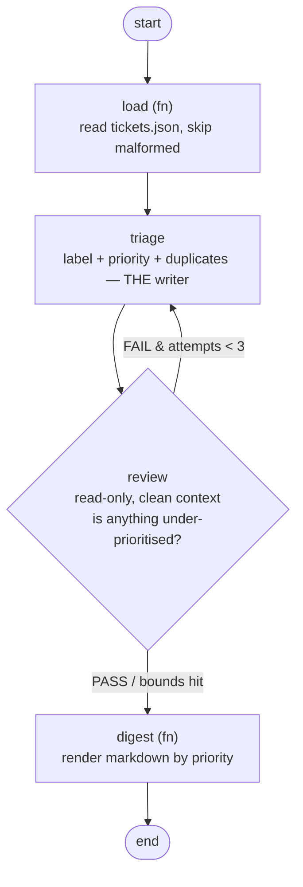
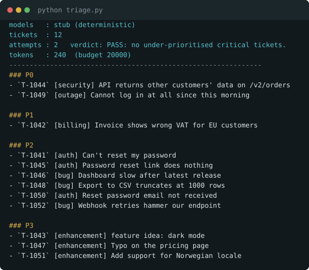
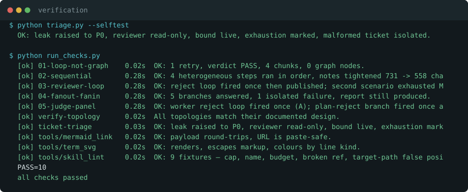

# Worked example — support ticket triage

A full run of the skill on a real-shaped problem, start to finish. This is what
using it actually looks like.

## The request

> *"We get 100+ support tickets a day. I want a multi-agent system: one agent
> labels them, one assigns priority, one detects duplicates."*

Three agents, named up front. That is the tell.

## Phase 0 — scope

| Question | Answer |
|---|---|
| Task | raw tickets in → `{label, priority}` per ticket + a digest |
| Volume | 12 in the fixture; ~100/day in reality. Interactive, not batch |
| **Failure that hurts** | **Under-prioritising.** A cross-account data leak filed P2 sits in the backlog for a week. Over-prioritising just annoys someone |
| Ceilings | Seconds, cents |
| Current pain | Manual triage, inconsistent between people |

Note how asymmetric the failure is. That single answer determines the whole
design: the reviewer's only job is catching under-prioritisation.

## Phase 1 — the ladder

| Rung | Verdict |
|---|---|
| 1 · Plain script | **Climb.** Keyword rules can label some tickets, but "how severe is this really" is judgement a rule cannot encode |
| 2 · Loop | **Climb.** Schema validity is assertable (`priority ∈ P0..P3`); *correctness* of a priority is not. And a wrong priority is the failure that hurts |
| **3 · Loop + reviewer** | **STOP.** A reviewer seeing tickets + assignments — but never the writer's reasoning — catches under-prioritisation |
| 4 · Panel | No. One defect class matters. One lens covers it |
| 5 · Fan-out | No. 100 short tickets is nowhere near a context window |
| 6 · Durable | No. Runs in seconds, on demand |

**Three "agents" collapsed into one writer.** Labelling, prioritising and
duplicate-detection all need the *same* context — the full ticket list. Splitting
them means three models each seeing less than the one model would have, and
duplicate-detection is impossible without seeing every ticket anyway. That is
the Data Processing Inequality argument from `references/evidence.md` in
miniature: each handoff can only lose information.

## Phase 2 — the design

```
        ┌──────────────────────────────────────┐
        │ load  (fn)                           │
        │ read tickets.json, skip malformed    │
        └──────────────────┬───────────────────┘
                           ▼
        ┌──────────────────────────────────────┐ ◀────────┐
        │ triage                               │          │
        │ label + priority + dupes — THE writer│          │ FAIL
        └──────────────────┬───────────────────┘          │ (attempts < 3)
                           ▼                              │
        ┌──────────────────────────────────────┐          │
        │ review        read-only, clean context│ ─────────┘
        │ is anything under-prioritised?        │
        └──────────────────┬───────────────────┘
                           ▼ PASS / bounds hit
        ┌──────────────────────────────────────┐
        │ digest  (fn)   render by priority    │
        └──────────────────────────────────────┘
```



[**Edit this diagram**](https://mermaid.live/edit#pako:eNptUctuwjAQ_JWVDxWopPR1qhAVElSt1EMlesMcTLwhLo4d2ZumEfDvXROEeqgvnn3NrMd7kXuN4glEYX2blyoQfM6lAz7LwSoSJ9ZDyLIpWK_0Sop0waBww8kmjKcBOSKT75DizVf0bgRxZ2qolC18qFBLse7ZTnOJh4JRW2SmHpxorNqghWuog_HBUMdQN7U1uSKMIJv727tH-HxdQMtVDBfSnuJEG_DbYLuXogeX7TLvbDeC3KJykHtH-EOnoomgXEelcVtonMaQndVNRP0sxbGX6OmSxEGKl9nbO1yBIsKqpggTeJDicF7jn_6P2XIJY9h4FohQGkrd2mwxEhvQg79mpjXYu7DTvnWw6S6GXF58nkkvXgxWPLAeihGICkOljE4fyRZQiRVKDlgDC9VY1j2mNtWQX3Yu5xKFBjnT1Jo9nvP-QVXn9PEXkuWxjg==)
— opens mermaid.live with it already loaded.

### State

| Field | Owner (only writer) | Reducer |
|---|---|---|
| `tickets` | load | append |
| `assignments` | **triage only** | **replace** |
| `verdict`, `feedback` | **review only** | replace |
| `attempts` | triage | counter |
| `tokens_spent` | any model call | sum |
| `errors` | any | append |
| `digest` | digest | replace |

### Bounds

`MAX_ATTEMPTS = 3` · `BUDGET_TOKENS = 20_000`, both in the loop condition ·
on exhaustion the digest ships **marked `UNREVIEWED`** rather than silently.

### Cost — and why rung 3 rather than 5

The number the skill makes you produce *before* building. It is only meaningful
as a comparison, so here are all three options for the same 12 tickets:

| Option | Arithmetic | Worst case |
|---|---|---|
| Rung 2 — loop, no reviewer | 1 × 2.5k | **~2.5k tokens** |
| **Rung 3 — chosen** | 2 rounds × (2.5k triage + 1.5k review) | **~8k typical, 12k worst** |
| Rung 5 — fan-out per ticket | 12 items × 2 attempts × (400 + 300) | **~17k, and no accuracy gain** |

Rung 3 costs ~3× the bare loop and buys the one thing that matters: the leak
gets caught. Rung 5 costs *more* than rung 3 and buys nothing here — the
tickets fit in one context, so splitting them only loses cross-ticket
information (you can't spot duplicates if each agent sees one ticket).

At 100 tickets/day this is roughly **$0.05/day** on current pricing.

## Phase 3 — target

`plain-code.md`. Two model calls and one conditional edge do not justify a
framework. ~200 lines of Python, no dependencies.

## Phase 4 — verification (rungs 1–3: assert behaviour, not topology)

| # | Assertion | Result |
|---|---|---|
| 1 | Reviewer is read-only — snapshot assignments, run reviewer, compare | asserted every round, inline |
| 2 | Bound is live — substitute a never-passing reviewer | stops at `MAX_ATTEMPTS` |
| 3 | Exhaustion terminal reachable **and** marked | digest carries `UNREVIEWED` |
| 4 | Failure isolated — inject a malformed ticket | skipped, other 12 complete |
| + | Counts — one assignment per ticket, no duplicate ids | catches reducer bugs |

## The run



```
models   : stub (deterministic)
tickets  : 12
attempts : 2   verdict: PASS: no under-prioritised critical tickets.
tokens   : 240  (budget 20000)
--------------------------------------------------------------
### P0
- `T-1044` [security] API returns other customers' data on /v2/orders
- `T-1049` [outage] Cannot log in at all since this morning

### P1
- `T-1042` [billing] Invoice shows wrong VAT for EU customers
...
```

**`attempts: 2` is the whole story.** On the first pass the writer filed
`T-1044` — *"API returns other customers' data"* — as **P2**. Plausible, quiet,
and wrong. The reviewer, seeing only the tickets and the assignments, flagged it
as a cross-account exposure that must be P0. The second pass fixed it.

That is one reviewer catching a real security misclassification, for ~1.5k tokens.



## Run it yourself

```bash
python examples/ticket-triage/triage.py            # the digest
python examples/ticket-triage/triage.py --selftest # the four assertions
```

Runs offline with deterministic stub models — no API key. Set
`ANTHROPIC_API_KEY` to use real models (sonnet writer, haiku reviewer, so the
producer never grades itself).

## What building this caught

Two real defects, both found by *running* the skill rather than reading it:

1. **A state-drift bug in this example.** `assignments` is a list the design
   marks `replace`, but the first `apply()` helper inferred the reducer from the
   Python type — list means append. Round 2 stacked on round 1, so `T-1044`
   appeared twice, once at P2 and once at P0. Reducers are now **declared, never
   inferred**, and a count assertion catches the whole class.
2. **The same footgun ships in `references/targets/plain-code.md`**, which shows
   exactly that type-inferring `apply()`. Filed for fixing.
