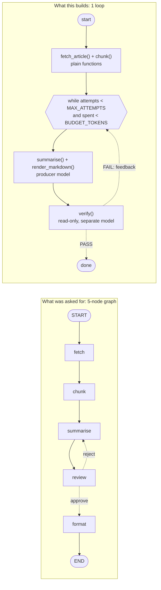

# Loop, Not Graph — the gate's most common verdict

The request:

> "Fetch an article, chunk it, summarise each chunk, review the result, and
> format it as markdown. Five steps — build me a 5-node graph."

The answer is no. This directory is the working counter-proposal: one agent
loop, a read-only verifier, a bounded retry. **No LangGraph. No graph
framework. Stdlib only.**

Refusing to build a graph is a successful use of the orchestration-design skill,
not a failure to use it. This is what "build the loop instead" concretely
looks like.

## Running the five criteria

A graph earns its complexity only if at least one of these is true. Here is the
honest scoring for this request:

| Criterion | Hit? | Why |
|---|---|---|
| **Real specialties** (different models, tools, or prompts) | No | Fetch is `urllib`. Chunking is string splitting. Markdown rendering is a template. Only summarising needs a model, and it's one model with one prompt. Three of the five "nodes" contain no model call at all. |
| **Parallelism genuinely helps** | No | One article, four chunks, ~800 tokens. Fan-out over four short chunks costs more in coordination and state plumbing than it saves in wall-clock. A `for` loop is the right primitive. |
| **Independent read-only reviewer** | **Partially** | Yes, the review step should be a separate model that never edits the draft. But that does **not** require a graph — a loop calls a verifier in its condition. That is exactly what `verify()` is here. |
| **Failure isolation** | No | If the fetch or the summariser fails, the output is worthless. There is no surviving partial result worth protecting with per-node error fields and a checkpointer. |
| **Auditable routing** | No | There is one decision in the entire task: "is the draft good enough?" A single `if verdict == "PASS": break` is already fully auditable — you can read the whole control flow in one screen. |

**One partial hit, and a loop already covers it.** Verdict: loop.

The tell that the request was mis-shaped: "chunk it" and "format as markdown"
were being counted as nodes. They are functions. A node needs a job a single
loop couldn't hold — a different model, different tools, or a read-only
reviewer role. "A step I could inline" is not a node.

## Side by side



Same behaviour. The right-hand side is under 200 lines of stdlib Python with no
dependency, no state schema to keep from drifting, no reducers, no
`recursion_limit`, and one place to look when it misbehaves.

What survived the cut is the part that was actually load-bearing:

- the verifier is **read-only** — it returns `(verdict, reasons)` and the loop
  asserts the draft is byte-identical after the call
- the producer **never grades itself** — `writer_model` and `verifier_model`
  are separate objects (different models in a real deployment)
- the loop is **bounded twice** — `MAX_ATTEMPTS = 3` and a token budget checked
  in the loop condition, so it cannot run forever or spend forever

Those three rules are orchestration-design discipline. None of them need a graph.

## When this becomes a graph

Flip any one of these requirements and the gate's answer changes:

- **"...for 400 articles, nightly."** Now parallelism is real. Fan-out with
  `Send` over the article list, fan-in to merge — and failure isolation starts
  to matter too, because one bad article must not sink the other 399. That is
  Pattern C.
- **"...and legal has to sign off on any claim about a named company."** That is
  a real specialty: a different model, a different prompt, a different
  escalation path, and a verdict that must be logged separately from the
  editorial review. Second node, and now routing is worth making explicit.
- **"...review it for accuracy, tone, and legal exposure, and only ship on a
  majority."** Three reviewers with different lenses running in parallel, then
  a synthesis step. That is Pattern D (see `../05-judge-panel/`).
- **"...and if the fetch fails, still ship the other sections."** Failure
  isolation becomes a requirement rather than a nicety: nodes returning error
  fields plus a checkpointer so retries resume instead of restarting.
- **"...and I need to see which step produced which claim, for audit."**
  Auditable routing as a product requirement, not a debugging convenience.

Note what is *not* on that list: "the pipeline has more steps." Adding a
sixth string-manipulation step to this task still yields a loop.

## Run

```bash
python3 loop.py
```

No API key, no `pip install`, no network. The stub models are deterministic and
rigged so the verifier **FAILs the first draft and PASSes the second** — the
retry loop is exercised exactly once, every run. The script ends in `assert`
statements (`attempts == 2`, first verdict `FAIL`, final verdict `PASS`, spend
under budget, draft unmodified by the verifier), so it cannot silently rot: if
the behaviour changes, `python3 loop.py` exits non-zero.

## Run output

```
=== loop trace ===
chunks (plain function, not nodes): 4
   attempt 1: FAIL - the summary drops every concrete figure from the source; a reader cannot check any claim.
   attempt 2: PASS - claims are traceable to numbers in the source.
tokens_spent: 823 / 5000
=== final ===
# Summary

Source: https://example.invalid/articles/grid-storage

- Grid-scale batteries crossed a threshold this year.
- Costs fell faster than forecast. (figures: 180, 2020, 65)
- Duration is the open question.
- Regulation lags the hardware.

OK: 1 retry, verdict PASS, 4 chunks, 0 graph nodes.
```

Exit code 0.
