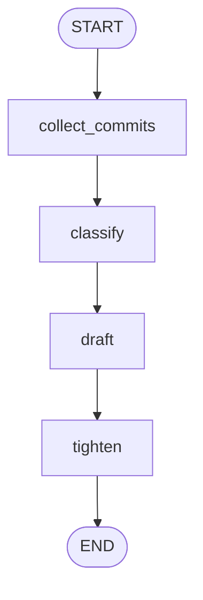
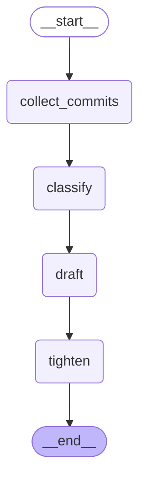

# Sequential Pipeline — LangGraph Reference Implementation

Release range → **collect_commits** (no model) → **classify** (cheap fast model)
→ **draft** (strong model) → **tighten** (temperature-0 model) → END. Four
nodes, four edges, no conditionals, no loops, no fan-out.

This is Pattern A from the orchestration-design skill, and it is the smallest
thing in this repo that is still legitimately a graph.

## Scenario

Generate customer-facing release notes for `v1.4.0..v1.5.0` from a git log.
`collect_commits` parses a hardcoded `git log --format='%h %s'` fixture into
`{sha, subject}` dicts. `classify` buckets each commit into
breaking/feat/fix/chore. `draft` turns the buckets into prose. `tighten` trims
that prose under a hard character limit without dropping breaking changes.

## The gate: why graph, not loop

**The only thing that earns the graph here is that each step needs a different
model.** Nothing else about this pipeline is graph-shaped — it is a straight
line, it has no branches, it never revisits a node.

| Step | Model | Why that model and not another |
|---|---|---|
| `collect_commits` | **none** | Parsing `%h %s` is exact. A model here is slower, costlier, and can hallucinate a sha that was never in the log. |
| `classify` | cheap + fast (haiku) | Short, high-volume, low-judgement labelling. Paying sonnet rates per commit buys nothing. |
| `draft` | strong (sonnet) | The only step producing customer-facing prose. This is the one place the quality difference is visible to a reader. |
| `tighten` | temperature 0 (haiku) | Trimming must be reproducible — the same draft must yield the same published notes twice. Creativity is a defect at this step. |

**If all four steps used the same model, this collapses to a loop.** It would
be a `for prompt in prompts: out = model(prompt)` over four prompts, and
writing it as a graph would be pure ceremony: a StateGraph, a TypedDict, four
`add_edge` calls and a `compile()` to express what four sequential lines
already say. Say it out loud during design — if you cannot name a *different*
model, tool, or failure boundary per step, do not build the graph.

The secondary earner is the failure boundary: `classify` can produce a label
outside the allowed set, and that is contained inside one node (defaulted to
`chore`, recorded in `errors`) rather than corrupting the draft.

## Nodes

| Node | Job | Model (real mode) | Writes |
|---|---|---|---|
| `collect_commits` | Parse the git-log fixture into `{sha, subject}` | **none** (deterministic) | `commits` |
| `classify` | Bucket each commit as breaking/feat/fix/chore | haiku | `buckets`, `errors` |
| `draft` | Write release-notes prose from the buckets, breaking changes first | sonnet | `notes_draft` |
| `tighten` | Trim under `MAX_CHARS`, keep every breaking change | haiku, **temperature 0** | `notes_final` |

## State schema

| Field | Type | Owner (only writer) | Reducer |
|---|---|---|---|
| `repo_range` | str | caller input | replace |
| `commits` | list[dict] | `collect_commits` | replace |
| `buckets` | dict[str, list[str]] | `classify` | replace |
| `notes_draft` | str | `draft` | replace |
| `notes_final` | str | `tighten` | replace |
| `tokens_spent` | int | `classify`, `draft`, `tighten` (`collect_commits` contributes 0 — it calls no model) | `operator.add` (running sum) |
| `errors` | list[str] | any failing node | `operator.add` (failure isolation) |

Every field has exactly one owning node except the two shared, add-reduced
accumulators, which is the point of using a reducer on them.

## Bounds

| Bound | Value | Where enforced |
|---|---|---|
| Whole-run step cap | `recursion_limit = 10` | `graph.invoke(..., config=...)` |
| Token budget | `BUDGET_TOKENS = 5_000` | `tighten()` — over budget it skips the model call and trims deterministically via `_truncate` |
| Output length | `MAX_CHARS = 600` | `tighten()` prompt, and `_truncate` as the local fallback |
| Classifier failure isolation | unknown label → `chore` + `errors` entry | `classify()` |

There is no attempt counter because there is no loop-back edge — with no
conditional edges there is nothing to bound but total steps. The token budget
is checked inside a node rather than by a router for the same reason: this
graph has no routers.

## Hand design (Mermaid)



## Compiled graph (`graph.get_graph().draw_mermaid()` output)



Same topology as the hand design, edge for edge: one linear chain from
`__start__` to `__end__`, all solid edges because there are no conditionals.

## Run

```bash
pip install -U langgraph            # add langchain-anthropic for real models
python graph.py
```

- **No API key** (default): deterministic stub models stand in for all three.
  The stubs honour the same prompt/response contract as the real models — the
  classify stub reads the `<sha> <subject>` lines out of its prompt and emits
  `<sha> <bucket>` lines back.
- **`ANTHROPIC_API_KEY` set**: automatically upgrades to real Anthropic models
  (haiku classifier, sonnet drafter, haiku-at-temperature-0 tightener).

## Captured run output

```
$ python graph.py
=== compiled mermaid ===
[... see the fence above ...]

=== run trace ===
models: stub (deterministic)
commits parsed: 7
  breaking  1 ['feat!: drop the v1 /export endpoint']
  feat      2 ['feat: add per-workspace API tokens', 'feat: bulk CSV import for contacts']
  fix       2 ['fix: stop double-charging annual plan proration', 'fix: correct timezone on scheduled report emails']
  chore     2 ['chore: bump pinned postgres client to 16.2', 'chore: rotate the staging signing key']
draft chars: 731  final chars: 558  tokens_spent: 150
=== final ===
This release focuses on giving teams finer-grained control over access and on cleaning up a handful of long-standing billing and scheduling papercuts that customers have reported over the last two cycles. [breaking] feat!: drop the v1 /export endpoint. [feat] feat: add per-workspace API tokens. [feat] feat: bulk CSV import for contacts. [fix] fix: stop double-charging annual plan proration. [fix] fix: correct timezone on scheduled report emails. [chore] chore: bump pinned postgres client to 16.2. [chore] chore: rotate the staging signing key. [trimmed]

OK: 4 heterogeneous steps ran in order, notes tightened 731 -> 558 chars.
$ echo $?
0
```

Asserted at the end of the run: all 7 commits parsed, the `feat!:` commit
landed in `breaking`, the draft exceeded `MAX_CHARS` (so tightening was real
work), the final is within `MAX_CHARS`, and `errors` is empty.
