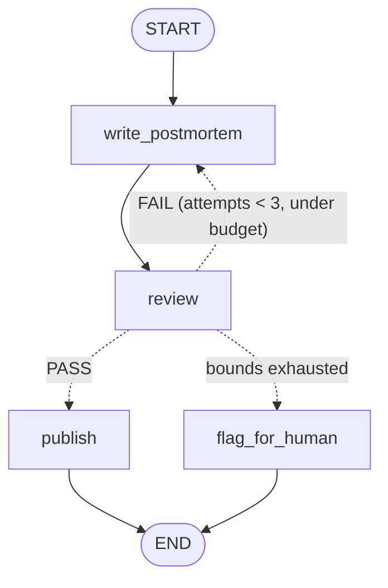
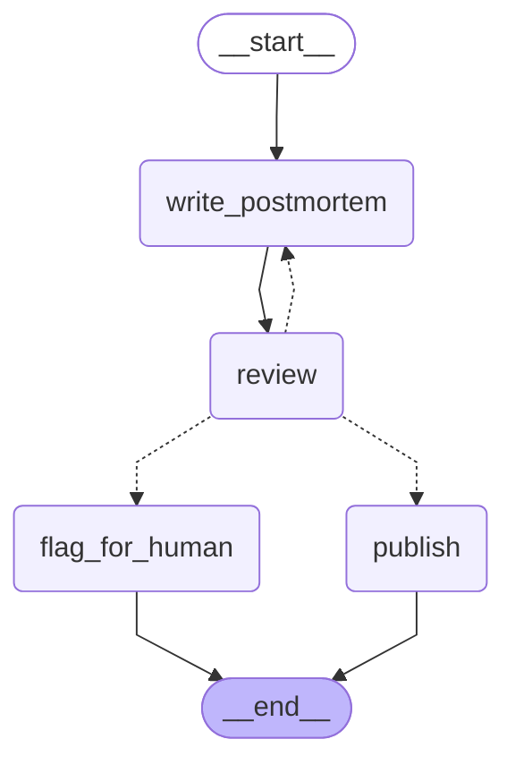

# Single-Reviewer Bounded Reject Loop — LangGraph Reference Implementation

Incident + facts → **write_postmortem** (producer) → **review** (read-only,
different cheaper model) → **Pass?** gate → **publish** *or* **flag_for_human**
→ END. On FAIL the reviewer's reasons loop back to the writer, bounded by
`MAX_ATTEMPTS = 3`, `BUDGET_TOKENS = 4_000` and `recursion_limit = 25`.

This is Pattern B from the orchestration-design skill — the canonical
producer/critic loop.

## Scenario

Draft a **customer-facing incident postmortem**. A postmortem that goes out to
customers is not publishable unless it states both a root cause and the
customer impact, so a read-only reviewer grades each draft and returns `PASS`
or `FAIL: <what is missing>`. FAIL loops back to the writer with the reasons
attached.

The interesting case is the one where the loop *cannot* succeed: if the facts
never establish a root cause, no amount of rewriting will satisfy the reviewer.
That run must not publish. It routes to `flag_for_human` with the best-effort
draft and the full review trail.

## The gate: why graph, not loop

A single producer call is a loop. This is a graph because of three things a
straight `for` loop does not give you:

1. **Two different models with different jobs.** The producer is sonnet; the
   reviewer is haiku at temperature 0. A model grading its own homework is the
   single most common way this pattern degrades into a rubber stamp — the
   reviewer must be a separate node on a separate model, and it must be
   *read-only*: it writes `verdict`, `feedback`, `review_log`, and is
   structurally incapable of touching `draft`.
2. **A cyclic edge with real routing.** `review → write_postmortem` is a
   loop-back, and the router that owns it has three outcomes, not two.
3. **Two distinct terminal states.** `publish` and `flag_for_human` are
   different outcomes with different downstream consequences. Collapsing them
   into "return the draft and let the caller sort it out" is exactly the bug
   this example exists to prevent.

If the reviewer ran the same model as the producer *and* there were only one
terminal state, this would be `for _ in range(3): draft = model(draft)` and
should be written that way.

## The failure this example is built to avoid

The safe branch that is wired but never reachable. It is easy to write a gate
that reads `if verdict == "PASS" or attempts >= MAX: return "publish"` — the
attempt bound then *silently ships an unreviewed postmortem to customers*, and
because the happy path always passes in testing, nobody notices.

Here, every exhausted bound routes to `flag_for_human`, and the demo
**exercises that branch on every single run** (scenario 2 below). A branch you
have never executed is a branch you do not have. Reachability is not a design
property you can assert on paper; run it.

## Nodes

| Node | Job | Model (real mode) | Writes |
|---|---|---|---|
| `write_postmortem` | Producer. Rewrites the full draft each round from facts + feedback. Never invents facts. | sonnet | `draft`, `attempts`, `errors` |
| `review` | **Read-only** critic. Grades the draft against `REQUIRED_SECTIONS`, returns PASS or FAIL + reasons. Never edits the draft. | haiku, **temperature 0** (different from the producer) | `verdict`, `feedback`, `review_log` |
| `gate` | Router (not a node). PASS → publish; FAIL under bounds → retry; bounds exhausted → human. | — | — |
| `publish` | Terminal. The reviewer passed it. | none | `status="published"`, `final` |
| `flag_for_human` | Terminal. Bounds exhausted — hands the best-effort draft plus the full review trail to a person. | none | `status="needs_human"`, `final` |

## State schema

| Field | Type | Owner (only writer) | Reducer |
|---|---|---|---|
| `incident` | str | caller input | replace |
| `facts` | list[str] | caller input | replace |
| `draft` | str | `write_postmortem` | replace |
| `attempts` | int | `write_postmortem` | replace (counter) |
| `verdict` | str | `review` | replace |
| `feedback` | str | `review` | replace |
| `review_log` | list[str] | `review` | `operator.add` — one entry per round, the audit trail (you can't clear an add-reduced field, and here you don't want to) |
| `tokens_spent` | int | `write_postmortem`, `review` | `operator.add` (running sum) |
| `errors` | list[str] | any failing node | `operator.add` (failure isolation) |
| `status` | str | `publish` **or** `flag_for_human` | replace |
| `final` | str | `publish` **or** `flag_for_human` | replace |

`status` and `final` are the one place two nodes share ownership. It is safe
because the two are mutually exclusive terminals — exactly one runs per
invocation — and it is deliberate: a single field the caller reads to learn
the outcome beats making the caller check which terminal fired.

## Bounds

| Bound | Value | Where enforced | Behaviour when hit |
|---|---|---|---|
| Rewrite loop | `MAX_ATTEMPTS = 3` | `gate()` router | → `flag_for_human` |
| Token budget | `BUDGET_TOKENS = 4_000` | `gate()` router | → `flag_for_human` |
| Whole-run step cap | `recursion_limit = 25` | `graph.invoke(..., config=...)` | raises — the backstop, not the plan |
| Writer failure isolation | try/except → `errors` | `write_postmortem()` | keeps the last good draft, never poisons downstream state |

Two independent bounds, because attempts and spend fail in different ways: a
cheap model can burn all 3 attempts without touching the budget, and an
expensive one can blow the budget on attempt 1.

## Hand design (Mermaid)



## Compiled graph (`graph.get_graph().draw_mermaid()` output)



Same topology as the hand design, edge for edge: one solid chain
`__start__ → write_postmortem → review`, three dotted conditional edges out of
`review` (to `publish`, `write_postmortem`, `flag_for_human`), and both
terminals solid into `__end__`. The compiled version just renders conditional
edges as dotted and drops the labels.

## Run

```bash
pip install -U langgraph            # add langchain-anthropic for real models
python graph.py
```

- **No API key** (default): deterministic stub models. They are rigged so both
  branches fire on every run — draft v1 always omits `## Customer impact` (so
  round 1 always FAILs), and `## Root cause` appears only when the facts
  actually contain one.
- **`ANTHROPIC_API_KEY` set**: automatically upgrades to real Anthropic models
  (sonnet producer, haiku reviewer at temperature 0 — the producer never grades
  itself).

Two scenarios run per invocation of the script:

| Scenario | Input | Path taken | Outcome |
|---|---|---|---|
| 1. passes after one rejection | facts include a root cause | write → review (FAIL) → write → review (PASS) → publish | `attempts=2`, `status="published"` |
| 2. bounds exhausted | facts state the cause is unknown | write → review (FAIL) × 3 → flag_for_human | `attempts=3`, `status="needs_human"` |

## Captured run output

```
$ python graph.py
=== compiled mermaid ===
[... see the fence above ...]

models: stub (deterministic)

=== run trace: passes after one rejection ===
attempts: 2  verdict: PASS  status: published  tokens_spent: 240
   [attempt 1] FAIL: not publishable, missing section(s): ## Customer impact.
   [attempt 2] PASS: publishable — cause and impact are both stated.
--- final ---
# 2026-07-21 API 5xx spike (34 min)

## What happened
Elevated 5xx on api.example.com from 14:02 to 14:36 UTC. Mitigated by rolling back v1.5.0 at 14:31 UTC.
## Root cause
root cause: a bad connection-pool limit shipped in release v1.5.0.
## Customer impact
Requests from affected workspaces failed during the window; no data was lost and no action is required from you.

=== run trace: bounds exhausted -> human ===
attempts: 3  verdict: FAIL  status: needs_human  tokens_spent: 360
   [attempt 1] FAIL: not publishable, missing section(s): ## Root cause, ## Customer impact.
   [attempt 2] FAIL: not publishable, missing section(s): ## Root cause.
   [attempt 3] FAIL: not publishable, missing section(s): ## Root cause.
--- final ---
# [UNPUBLISHED] 2026-07-24 intermittent checkout failures (cause unknown)
Blocked after 3 attempts (360 tokens). Review trail:
[attempt 1] FAIL: not publishable, missing section(s): ## Root cause, ## Customer impact.
[attempt 2] FAIL: not publishable, missing section(s): ## Root cause.
[attempt 3] FAIL: not publishable, missing section(s): ## Root cause.

Best effort draft:
## What happened
Checkout error rate rose from 0.2% to 6% between 09:10 and 11:45 UTC. No deploy, config change, or infra alert correlates with the window. Investigation is ongoing; no cause has been established.
## Customer impact
Requests from affected workspaces failed during the window; no data was lost and no action is required from you.

OK: reject loop fired once then published; second scenario exhausted MAX_ATTEMPTS and reached flag_for_human.
$ echo $?
0
```

Note scenario 2's best-effort draft: the writer correctly refused to invent a
root cause it was not given, which is why the reviewer keeps failing it. That
is the reviewer working, not the writer failing — and it is precisely the case
that must reach a human rather than a customer.
