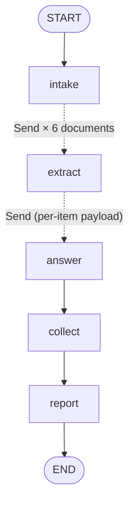
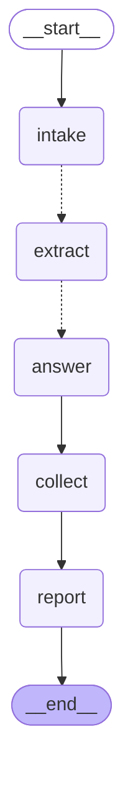

# Fan-out / Fan-in Graph — LangGraph Reference Implementation

Vendor security questionnaires. **Intake** lists N PDFs → fan out **one branch
per document** via `Send` → each branch runs **Extract** (pull questions) then
**Answer** (draft from policy snippets) → all branches fan in to **Collect** →
**Report** → END.

This is Pattern C (fan-out/fan-in with the Send API) from the orchestration-design
skill. Six fixture documents; one of them (`D3`) is a scanned PDF with no text
layer, so its branch **deterministically fails on every run** — and the run
still ships a report for the other five.

## Why the gate said graph, not a loop

The loop-first gate says: use a `for` loop unless you hit a real graph
requirement. This scenario hits two, hard.

- **Parallelism.** The documents are genuinely independent — no document's
  answers depend on another's. A sequential loop over 6 (or 600) PDFs pays the
  full latency of every model call end to end. Fan-out runs them in one
  superstep.
- **Failure isolation.** In a plain loop, an unparseable PDF either raises and
  kills the whole batch, or you wrap the body in a try/except and hand-roll
  partial-result bookkeeping. The graph gives you that for free: a branch that
  dies writes to `errors` and stops, and the fan-in barrier still fires. This
  is the most valuable property of fan-out and the one most examples skip.

Either requirement alone is arguable. Both together is a graph.

## The three things this example teaches

1. **Fan-in reducers are mandatory.** Every field written by the parallel
   branches is `Annotated[..., operator.add]`. Without it, N concurrent writers
   collide: LangGraph raises `InvalidUpdateError`, or — on a replace channel
   that tolerates it — the last branch to finish silently wins and the other
   N-1 results vanish with **no error at all**. The silent variant is the one
   that ships to production.
2. **Failure isolation is the point.** `extract()` try/excepts into `errors`
   and returns **no `goto`**, so that branch stops while its siblings run to
   completion. The run asserts `len(answers) == 5`, `len(errors) == 1`, and
   that a report was still produced.
3. **Per-item payloads, not shared state.** Each `Send` payload is the whole
   contract for that branch (its document plus the policy snippets it needs).
   Branches must not read sibling state: mid-superstep, sibling writes are not
   committed, so a read is a race — stale data, in an order that changes run to
   run. Order-sensitive work happens in `collect`, after the barrier, which is
   why `collect` sorts by `doc_id`.

## Nodes

| Node | Job | Runs | Model (real mode) |
|---|---|---|---|
| `intake` | List the units of work (fixture manifest) | once | — |
| `fan_out_documents` | Router: one `Send` per document; enforces `MAX_FANOUT` and the pre-flight token estimate | once (edge fn) | — |
| `extract` | Branch step 1: pull questions from **one** document; owns its own failure | **N in parallel** | haiku, temp 0 |
| `answer` | Branch step 2: draft answers for **one** document from the policy snippets | **N-1 in parallel** (failed branches never reach it) | sonnet |
| `collect` | Fan-in barrier: tally, sort by `doc_id`, budget check | once | — |
| `report` | Render the deliverable including the partial-failure caveat | once | — |

`extract` hands off to `answer` with `Command(goto=Send("answer", payload))`,
so the *second* step of the branch also gets a per-item payload rather than the
half-merged global channel. `add_node("extract", extract,
destinations=("answer",))` declares that edge so the compiled diagram shows it.

## State schema

| Field | Type | Owner (only writer) | Reducer | Fan-in? |
|---|---|---|---|---|
| `docs` | list[dict] | `intake` | replace | no — single writer |
| `questions` | list[dict] | `extract` (N parallel) | `operator.add` | **yes** |
| `answers` | list[dict] | `answer` (N parallel) | `operator.add` | **yes** — one entry per surviving document |
| `errors` | list[str] | any failing branch | `operator.add` | **yes** — failure isolation channel |
| `tokens_spent` | int | every model-calling node | `operator.add` (sum) | **yes** — budget summed across all branches |
| `summary` | dict | `collect` | replace | no — written after the barrier |
| `report` | str | `report` | replace | no — single writer |

Every **yes** row would be corrupted by a replace reducer. Every **no** row has
exactly one writer, in a superstep of its own.

## Bounds

| Bound | Value | Where enforced |
|---|---|---|
| Fan degree | `MAX_FANOUT = 12` | `fan_out_documents()` — never fan out an unbounded list |
| Pre-flight spend | `BUDGET_TOKENS // EST_TOKENS_PER_DOC` | `fan_out_documents()` trims the fan-out *before* paying |
| Token budget | `BUDGET_TOKENS = 5_000` | `collect()` sets `summary["over_budget"]`; `report()` prints the caveat |
| Whole-run step cap | `recursion_limit = 25` | `graph.invoke(..., config=...)` |
| Branch failure isolation | try/except → `errors`, no `goto` | `extract()` / `answer()` — a dead branch never poisons the fan-in |

No loop-back edges in this graph, so there is no attempt counter; the fan
degree cap plus `recursion_limit` are the step bounds.

## Hand design (Mermaid)



## Compiled graph (`graph.get_graph().draw_mermaid()` output)



Same topology as the hand design, edge for edge (`START→intake`,
`intake⇢extract`, `extract⇢answer`, `answer→collect`, `collect→report`,
`report→END`); the compiled version just renders the `Send` edges as dotted and
drops the labels. The fan-out multiplicity is a runtime property — the compiled
graph shows one `intake ⇢ extract` edge whether you fan out to 6 branches or
600.

## Run

```bash
pip install -U langgraph            # add langchain-anthropic for real models
python graph.py
```

- **No API key** (default): deterministic stub models. Fixture `D3` has no
  `%PDF` header, so its branch always fails — the run asserts
  `len(answers) == 5`, `len(errors) == 1`, and that `report` was produced.
- **`ANTHROPIC_API_KEY` set**: automatically upgrades to real Anthropic models
  (haiku extractor at temperature 0, sonnet drafter).

## Actual run output

```
=== compiled mermaid ===
(as above)

=== run trace ===
models: stub (deterministic)
fanned out : 6 branches (cap 12)
  extract [D1] 3 questions: encryption-at-rest, mfa, incident-response
  extract [D2] 3 questions: mfa, subprocessors, pen-test-cadence
  extract [D4] 2 questions: encryption-at-rest, data-residency
  extract [D5] 3 questions: incident-response, byo-key, subprocessors
  extract [D6] 2 questions: model-training-on-customer-data, pen-test-cadence
  answer  [D1] encryption-at-rest -> AES-256 at rest, keys in KMS, rotated every 90 days.
  answer  [D1] mfa -> MFA enforced org-wide via SSO; hardware keys for admins.
  answer  [D1] incident-response -> 24/7 on-call; Sev1 customer notification within 24h.
  answer  [D2] mfa -> MFA enforced org-wide via SSO; hardware keys for admins.
  answer  [D2] subprocessors -> Published subprocessor list; 30-day notice on changes.
  answer  [D2] pen-test-cadence -> Annual third-party pen test; summary letter on request.
  answer  [D4] encryption-at-rest -> AES-256 at rest, keys in KMS, rotated every 90 days.
  answer  [D4] data-residency -> EU and US regions; data pinned to region of signup.
  answer  [D5] incident-response -> 24/7 on-call; Sev1 customer notification within 24h.
  answer  [D5] byo-key -> BYOK available on Enterprise; CMK via KMS grants.
  answer  [D5] subprocessors -> Published subprocessor list; 30-day notice on changes.
  answer  [D6] model-training-on-customer-data -> NO POLICY MATCH — escalate
  answer  [D6] pen-test-cadence -> Annual third-party pen test; summary letter on request.
  ERROR   D3 (vendors/initech/scanned_questionnaire.pdf): extract failed: no text layer (bad PDF header) — needs OCR
summary: {'requested': 6, 'answered': 5, 'failed': 1, 'questions': 13, 'gaps': ['model-training-on-customer-data'], 'over_budget': False}
tokens_spent: 500 / 5000
=== final ===
VENDOR QUESTIONNAIRE RUN — 5/6 documents answered, 13 questions drafted
  [D1] vendors/acme/security_questionnaire.pdf  (3 answers)
  [D2] vendors/globex/vendor_review_2026.pdf  (3 answers)
  [D4] vendors/umbrella/soc2_followup.pdf  (2 answers)
  [D5] vendors/hooli/annual_diligence.pdf  (3 answers)
  [D6] vendors/stark/ai_addendum.pdf  (2 answers, 1 policy gap(s))
  [SKIPPED] D3 (vendors/initech/scanned_questionnaire.pdf): extract failed: no text layer (bad PDF header) — needs OCR
  policy gaps to escalate: model-training-on-customer-data
  NOTE: partial result — 1 document(s) isolated to the errors channel; rerun those alone.

OK: 5 branches answered, 1 isolated failure, report still produced.
```

`D3` is absent from the extract and answer traces and present exactly once in
`errors`. Its branch died alone; the other five never noticed. `tokens_spent`
of 500 is the `operator.add` sum across all 11 surviving model calls (5
extracts × 40 + 5 answers × 60), which no single branch could have computed.
