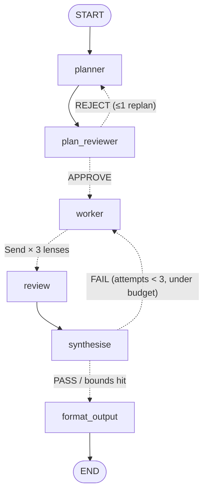
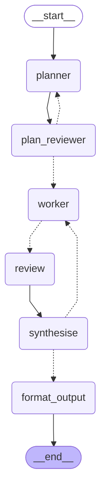

# Judge-Panel Graph — LangGraph Reference Implementation

Task → **Planner** → **Plan Reviewer** (read-only, one bounded replan) →
**Worker** (resident) → fan-out to N parallel **Reviewers** (ephemeral, one
lens each) → **Synthesise** (majority verdict + merged feedback) → **Pass?**
gate → **format_output** (final polish) → END. On FAIL, feedback loops back to
the Worker, bounded by `MAX_ATTEMPTS = 3` and `recursion_limit = 25`.

This is Pattern D (multi-reviewer judge panel) from the orchestration-design
skill, with a Pattern-B style plan-review loop bolted on after the Planner.

## Design decision: the Plan Reviewer ambiguity

The source diagram showed a "Plan Reviewer" without clear routing. Resolved
here as: a **read-only** node immediately after the Planner that returns
`APPROVE` or `REJECT: <reason>`. On REJECT it loops back to the Planner for
**exactly one** replan (`MAX_PLAN_ATTEMPTS = 2`); after that, or on APPROVE,
control proceeds to the Worker regardless. The Plan Reviewer never edits the
plan. The diagram's "turn into haiku" final step is generalised into a
deterministic-ish `format_output` polish node (temperature 0 with real models).

## Nodes

| Node | Job | Resident/Ephemeral | Model (real mode) |
|---|---|---|---|
| `planner` | Produce a short numbered plan | ephemeral | sonnet |
| `plan_reviewer` | Read-only APPROVE/REJECT of the plan | ephemeral | haiku (different from producer) |
| `worker` | Produce/revise the draft; keeps history across rounds | **resident** (history in `worker_messages`) | sonnet |
| `review` | One reviewer per lens (correctness, clarity, completeness), run in parallel via `Send`; sees **only** the current draft | **ephemeral** | haiku |
| `synthesise` | Majority verdict + merged FAIL feedback, counting only the current round's reviews | deterministic fn | — |
| `format_output` | Final polish of the passing draft | deterministic-ish | haiku, temp 0 |

## State schema

| Field | Type | Owner (only writer) | Reducer |
|---|---|---|---|
| `task` | str | caller input | replace |
| `plan` | str | planner | replace |
| `plan_verdict` | str | plan_reviewer | replace |
| `plan_attempts` | int | planner | replace (counter) |
| `worker_messages` | list[str] | worker | `operator.add` — the worker's resident history |
| `draft` | str | worker | replace |
| `attempts` | int | worker | replace (counter) |
| `reviews` | list[dict] | review (N parallel) | `operator.add` — fan-in; each entry tagged `{"round": attempts}` so synthesise counts only the current round (you can't clear an add-reduced field) |
| `verdict` | str | synthesise | replace |
| `feedback` | str | synthesise | replace |
| `tokens_spent` | int | every model node | `operator.add` (running sum) |
| `errors` | list[str] | any failing node | `operator.add` (failure isolation) |
| `final` | str | format_output | replace |

## Bounds

| Bound | Value | Where enforced |
|---|---|---|
| Worker revise loop | `MAX_ATTEMPTS = 3` | `gate()` router |
| Plan replan loop | `MAX_PLAN_ATTEMPTS = 2` (i.e. one replan) | `route_after_plan_review()` |
| Whole-run step cap | `recursion_limit = 25` | `graph.invoke(..., config=...)` |
| Token budget | `BUDGET_TOKENS = 20_000` | `gate()` ships best-effort when exceeded |
| Worker failure isolation | try/except → `errors` field | `worker()` never poisons downstream state |

## Hand design (Mermaid)



## Compiled graph (`graph.get_graph().draw_mermaid()` output)



Same topology as the hand design (edge for edge); the compiled version just
renders conditional edges as dotted without labels.

## Run

```bash
pip install -U langgraph            # add langchain-anthropic for real models
python graph.py
```

- **No API key** (default): deterministic stub models.
- **`ANTHROPIC_API_KEY` set**: automatically upgrades to real Anthropic models
  (sonnet producer, haiku reviewers — the producer never grades itself).

### Both conditional branches are exercised

A bounded branch that never fires in any run is wired, not proven. The run
covers both, and asserts on each:

| Scenario | Task | What fires | Assertions |
|---|---|---|---|
| **A** | `"Explain why the sky is blue"` | Plan approved first pass; reviewer panel rejects draft v1, so the **worker loop** fires once | `plan_attempts == 1`, `attempts == 2`, `verdict == PASS` |
| **B** | `"make it better"` | Plan is too thin, so the **plan-reject branch** fires and replans once | `plan_attempts == 2`, bounded by `MAX_PLAN_ATTEMPTS`, `verdict == PASS` |

The rigging is self-consistent rather than flag-driven: the stub planner
genuinely produces a 2-step plan for an under-specified task, and the stub plan
reviewer rejects any plan with fewer than 3 steps as too thin to verify work
against. Scenario B rejects for a principled reason, not because a switch was
flipped — which means the branch is testing the routing, not the stub.

### Topology check

```bash
python ../verify_topology.py 05-judge-panel
```

Parses both Mermaid fences in this README into edge sets and asserts they are
equal, so the diagrams cannot silently drift from the code.
